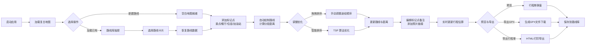

## 1. 产品概述

复古旅行地图风格的自驾路线规划与标记工具，面向自驾游爱好者与旅行规划者，提供沉浸式的路线设计体验。以复古地图美学为核心，融合现代交互式地图功能，让用户在规划旅程的同时感受经典旅行的浪漫情怀。

- 解决的问题：传统地图工具缺乏个性化与视觉温度，无法满足旅行爱好者对"仪式感"路线规划的需求
- 核心价值：将路线规划从功能性操作转化为充满情怀的创作过程，同时提供专业的行程计算能力

## 2. 核心功能

### 2.1 用户角色

| 角色 | 注册方式 | 核心权限 |
|------|----------|----------|
| 旅行者 | 无需注册，本地数据 | 创建/编辑/保存路线、添加标记、导出行程 |

### 2.2 功能模块

1. **地图交互区**：复古风格底图、缩放/平移/旋转操作、地图图层切换
2. **标记点管理**：四类标记（景点🏛️/餐厅🍽️/住宿🏨/加油站⛽）、自定义图标、标记属性编辑
3. **路线规划器**：点击添加途经点、拖拽重排、路线绘制、分段距离显示
4. **智能排序引擎**：多目的地 TSP 近似算法优化、手动调整顺序
5. **行程估算器**：总里程、预计耗时、油耗与油费计算、自定义油耗参数
6. **行程内容编辑**：添加文字备注、上传/关联照片链接、时间节点安排
7. **导出与预览**：路线缩略图生成、详细行程单（可打印）、GPX 文件导出
8. **路线库管理**：本地存储多条路线、路线加载/删除/重命名、路线卡片展示
9. **离线支持**：基础瓦片缓存、已保存路线离线可用

### 2.3 页面详情

| 页面名称 | 模块名称 | 功能描述 |
|----------|----------|----------|
| 主工作台 | 顶栏路牌导航 | 新建路线、路线库切换、导出菜单、主题切换 |
| 主工作台 | 左侧工具面板 | 标记工具选择、路线操作按钮、智能排序触发 |
| 主工作台 | 中心地图区 | Leaflet 交互式复古地图、路线绘制、标记显示 |
| 主工作台 | 右侧属性面板 | 当前选中对象属性编辑、行程信息、备注与照片 |
| 主工作台 | 底部信息栏 | 总里程、预计时间、油耗估算、途经点计数 |
| 路线库抽屉 | 路线卡片列表 | 展示所有本地路线、缩略图预览、加载/删除操作 |
| 行程预览弹窗 | 预览区 | 路线地图缩略图、行程时间轴、分段详情 |
| 导出弹窗 | 导出选项 | GPX 导出、行程单导出（HTML/打印）、图片导出 |

## 3. 核心流程

用户打开应用 → 地图加载（复古瓦片风格）→ 点击"新建路线"或从路线库加载 → 在地图上点击添加标记点（选择类型）→ 系统自动连接路线并计算距离 → 可手动调整途经点顺序或点击"智能排序"→ 为各标记点添加备注与照片 → 系统实时估算总行程时间与油耗 → 点击"预览"查看完整行程单 → 选择导出 GPX/行程单 → 自动保存到本地路线库

## 4. 用户界面设计

### 4.1 设计风格

**配色方案（核心）**
- 公路蓝（主色）：`#2C5F8F` — 用于路牌边框、按钮、路线主色
- 沙色（背景）：`#E8DCC4` — 地图底色、面板背景、营造羊皮纸质感
- 暖黄（强调）：`#D4A03C` — 路牌文字、标记点高亮、装饰元素
- 深棕（文字）：`#3E2C1C` — 正文文字、地图标签
- 复古红（警示）：`#8B3A2E` — 删除按钮、加油站标记
- 苔藓绿（辅助）：`#5A7A4A` — 景点标记、住宿标记

**字体选择**
- 标题字体：`"Playfair Display"` 或 `"Cinzel"` — 复古衬线体，营造旧地图标题感
- 正文字体：`"Crimson Pro"` 或 `"Lora"` — 优雅易读的衬线体
- 数字/路牌字体：`"Special Elite"` 或 `"Roboto Slab"` — 打字机风格，模拟老式路牌

**视觉元素**
- 背景：叠加纸张噪点纹理、折痕效果、泛黄渐变
- 路牌按钮：3D 凸起效果、铆钉装饰、倾斜角度（路牌真实感）
- 面板边框：双线装饰、角落花纹、仿木框效果
- 标记点：针式图钉、复古邮戳风格、带阴影的圆形徽章
- 路线：虚线+实线双层、箭头指示方向、里程标签

**动画与交互**
- 标记添加：图钉从天而降的弹跳动画
- 路线绘制：虚线流动效果，模拟车辆行驶
- 面板展开：卷帘门/卷轴展开动画
- 悬停效果：路牌轻微晃动、图钉轻微放大
- 地图平移：惯性滚动模拟纸质地图拖动

### 4.2 页面设计概览

| 页面名称 | 模块名称 | UI 元素 |
|----------|----------|---------|
| 主工作台 | 顶栏路牌 | 蓝色矩形路牌（带白边和铆钉）、暖黄文字、左右箭头装饰 |
| 主工作台 | 工具面板 | 卷轴式侧边栏、分类按钮（不同颜色代表标记类型）、分隔花纹 |
| 主工作台 | 地图区 | 沙色底图 + 复古滤镜、深棕色路线、彩色标记点、罗盘装饰 |
| 主工作台 | 属性面板 | 羊皮纸质感、横线记录纸纹理、手写体备注区、照片占位框 |
| 主工作台 | 底部栏 | 里程表样式显示、油量表图标、时间显示（复古时钟图标） |
| 路线库抽屉 | 卡片列表 | 相册式卡片、路线缩略图、便签式标题、装订孔装饰 |
| 预览弹窗 | 行程单 | 车票/明信片样式、撕线边缘、邮戳日期章、时间轴 |

### 4.3 响应式

- **桌面优先**：1440px 以上为最佳体验，三栏布局（工具-地图-属性）
- **平板适配**（1024px）：左右面板可折叠为抽屉式，地图占主要区域
- **手机适配**（768px 以下）：顶部工具栏 + 全屏地图 + 底部抽屉式面板，支持触摸手势
- **触摸优化**：标记点点击区域扩大至 48px，支持双指缩放与旋转

### 4.4 地图视觉增强

- **瓦片风格**：使用 Stamen Watercolor 或 CartoDB Voyager 叠加复古 CSS 滤镜（sepia, contrast, saturate）
- **装饰元素**：四角添加地图外框装饰、指北针罗盘、比例尺（仿制图上的刻度条）
- **标记样式**：
  - 景点：绿色圆形徽章 + 🏛️ 图标
  - 餐厅：暖黄圆形徽章 + 🍽️ 图标
  - 住宿：棕色方形 + 🏨 图标（仿汽车旅馆招牌）
  - 加油站：复古红盾形 + ⛽ 图标
- **路线样式**：主路线 `#2C5F8F` 蓝色实线 + `#D4A03C` 虚线描边，路口处标注里程数字
