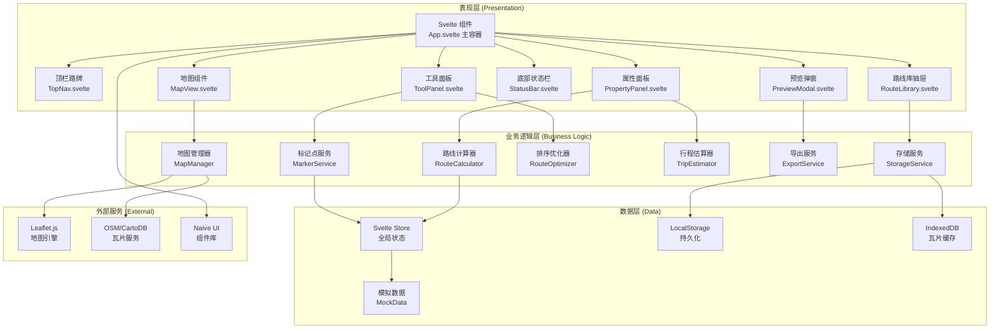
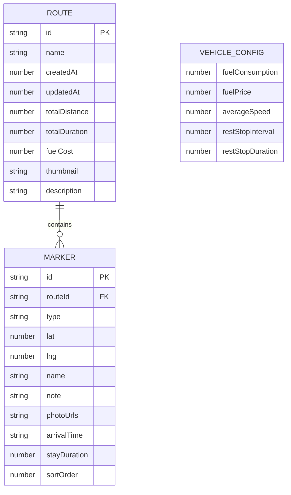

## 1. 架构设计



## 2. 技术描述

- **前端框架**：Svelte@4 + Vite@5 — 编译型框架，轻量高效，适合纯前端工具类应用
- **样式方案**：SCSS + CSS 变量 + Naive UI 主题定制
- **地图引擎**：Leaflet@1.9 — 轻量级开源地图库，支持丰富插件生态
- **UI 组件库**：naive-ui（通过 svelte-naive 适配或直接使用原生组件 + 自定义样式）
- **图标方案**：svelte-hero-icons + 自定义 SVG 复古路牌图标
- **状态管理**：Svelte 原生 Store（writable / derived / readable）
- **本地存储**：localStorage（路线数据）+ IndexedDB（瓦片缓存）
- **导出功能**：纯前端 Blob API（GPX 导出）、html2canvas（缩略图生成）
- **模拟接口**：MSW (Mock Service Worker) 或自定义 Promise 延迟模拟
- **离线支持**：Service Worker + 瓦片预缓存策略

## 3. 路由与组件定义

本项目为单页应用（SPA），通过组件显隐管理视图，无 URL 路由需求。

| 组件路径 | 组件名 | 核心职责 |
|----------|--------|----------|
| `src/App.svelte` | 主容器 | 布局管理、全局状态注入、弹窗挂载点 |
| `src/components/TopNav.svelte` | 顶栏路牌 | 新建/保存/导入导出、路线库入口、油耗设置 |
| `src/components/ToolPanel.svelte` | 工具面板 | 标记类型切换、智能排序按钮、路线操作 |
| `src/components/MapView.svelte` | 地图组件 | Leaflet 初始化、地图交互、图层渲染 |
| `src/components/PropertyPanel.svelte` | 属性面板 | 选中标记编辑、备注/照片管理、路线分段列表 |
| `src/components/StatusBar.svelte` | 状态栏 | 总里程/时间/油耗实时显示、途经点统计 |
| `src/components/RouteLibrary.svelte` | 路线库 | 路线卡片列表、加载/删除/重命名操作 |
| `src/components/PreviewModal.svelte` | 预览弹窗 | 行程单展示、缩略图预览、打印功能 |
| `src/components/ExportModal.svelte` | 导出弹窗 | GPX 配置、行程单格式选择 |
| `src/components/MarkerIcon.svelte` | 标记图标 | 复古风格 SVG 标记点组件 |
| `src/components/RoadSign.svelte` | 路牌按钮 | 通用路牌风格按钮组件 |

## 4. 模拟接口定义（Mock API）

```typescript
// src/types/api.ts

export interface MarkerData {
  id: string;
  type: 'attraction' | 'restaurant' | 'hotel' | 'gas';
  lat: number;
  lng: number;
  name: string;
  note: string;
  photoUrls: string[];
  arrivalTime?: string;
  stayDuration?: number;
}

export interface RouteData {
  id: string;
  name: string;
  createdAt: number;
  updatedAt: number;
  markers: MarkerData[];
  totalDistance: number;
  totalDuration: number;
  fuelCost: number;
  thumbnail?: string;
  description: string;
}

export interface VehicleConfig {
  fuelConsumption: number;  // L/100km
  fuelPrice: number;        // 元/L
  averageSpeed: number;     // km/h
  restStopInterval: number; // 每多少公里休息一次
  restStopDuration: number; // 每次休息分钟
}

export interface TileResponse {
  success: boolean;
  tileUrl: string;
  fromCache: boolean;
}

// 模拟 API 接口
export const MockAPI = {
  // 获取模拟瓦片 URL（模拟延迟 100-300ms）
  async getTile(z: number, x: number, y: number): Promise<TileResponse> {
    await new Promise(r => setTimeout(r, 100 + Math.random() * 200));
    return {
      success: true,
      tileUrl: `https://cartodb-basemaps-a.global.ssl.fastly.net/rastertiles/voyager/${z}/${x}/${y}.png`,
      fromCache: Math.random() > 0.7
    };
  },

  // 加载用户保存的路线列表
  async loadRoutes(): Promise<RouteData[]> {
    await new Promise(r => setTimeout(r, 500));
    const stored = localStorage.getItem('vintage_routes');
    return stored ? JSON.parse(stored) : [];
  },

  // 保存路线
  async saveRoute(route: RouteData): Promise<{ success: boolean; id: string }> {
    await new Promise(r => setTimeout(r, 300));
    return { success: true, id: route.id };
  },

  // 估算两点间距离（模拟地图服务 API）
  async estimateDistance(from: [number, number], to: [number, number]): Promise<number> {
    await new Promise(r => setTimeout(r, 150));
    return haversineDistance(from, to);
  }
};
```

## 5. 数据模型与存储

### 5.1 ER 图



### 5.2 LocalStorage Schema

```typescript
// Key: 'vintage_routes'
interface StoredData {
  version: 1;
  routes: RouteData[];
  vehicleConfig: VehicleConfig;
  settings: {
    tileStyle: 'vintage' | 'satellite' | 'standard';
    showCompass: boolean;
    mapRotation: number;
    language: 'zh-CN';
  };
}

// Key: 'vintage_tile_cache_{z}_{x}_{y}'
// 存储瓦片 blob URL（可选，使用 IndexedDB 替代）
```

### 5.3 IndexedDB 瓦片缓存结构

```
Database: vintage_map_cache
  Store: tiles
    Key: `${z}/${x}/${y}`
    Value: { blob: Blob, timestamp: number, url: string }
  
  Store: metadata
    Key: 'config'
    Value: { cachedCount: number, totalSize: number, lastCleanup: number }
```

## 6. 核心算法说明

### 6.1 Haversine 距离计算

用于两点间球面距离计算（不依赖地图服务 API 的离线方案）：

```typescript
function haversineDistance(
  [lat1, lon1]: [number, number],
  [lat2, lon2]: [number, number]
): number {
  const R = 6371; // 地球半径 km
  const dLat = (lat2 - lat1) * Math.PI / 180;
  const dLon = (lon2 - lon1) * Math.PI / 180;
  const a = 
    Math.sin(dLat/2) ** 2 +
    Math.cos(lat1 * Math.PI/180) * Math.cos(lat2 * Math.PI/180) * 
    Math.sin(dLon/2) ** 2;
  const c = 2 * Math.atan2(Math.sqrt(a), Math.sqrt(1-a));
  return R * c;
}
```

### 6.2 TSP 智能排序（最近邻 + 2-opt 优化）

```typescript
// 输入：标记点数组（含坐标），起点固定
// 输出：优化排序后的标记点数组
function optimizeRoute(markers: MarkerData[], startFixed = true): MarkerData[] {
  // 1. 最近邻算法生成初始解
  // 2. 2-opt 局部优化减少交叉
  // 3. 返回最优顺序
}
```

### 6.3 行程时间估算

```
基础行驶时间 = 总距离 / 平均速度
休息次数 = floor(总距离 / 休息间隔)
总停留时间 = Σ(标记点停留时间) + 休息次数 × 单次休息时长
总时间 = 基础行驶时间 + 总停留时间
总油耗 = (总距离 / 100) × 百公里油耗
总油费 = 总油耗 × 油价
```

## 7. 项目目录结构

```
d:\lhd064\
├── .trae\
│   └── documents\
│       ├── PRD.md
│       └── Tech-Architecture.md
├── src\
│   ├── App.svelte
│   ├── main.ts
│   ├── vite-env.d.ts
│   ├── styles\
│   │   ├── _variables.scss        # 复古配色变量
│   │   ├── _mixins.scss           # 路牌/纸张效果混入
│   │   ├── _animations.scss       # 动画关键帧
│   │   └── global.scss            # 全局样式
│   ├── components\
│   │   ├── TopNav.svelte
│   │   ├── ToolPanel.svelte
│   │   ├── MapView.svelte
│   │   ├── PropertyPanel.svelte
│   │   ├── StatusBar.svelte
│   │   ├── RouteLibrary.svelte
│   │   ├── PreviewModal.svelte
│   │   ├── ExportModal.svelte
│   │   ├── MarkerIcon.svelte
│   │   └── RoadSign.svelte
│   ├── stores\
│   │   ├── route.store.ts         # 当前路线状态
│   │   ├── map.store.ts           # 地图状态
│   │   ├── ui.store.ts            # UI 状态
│   │   └── settings.store.ts      # 设置与车辆配置
│   ├── services\
│   │   ├── map-manager.ts         # Leaflet 封装
│   │   ├── marker.service.ts      # 标记 CRUD
│   │   ├── route-calculator.ts    # 距离/路线计算
│   │   ├── optimizer.ts           # TSP 排序
│   │   ├── trip-estimator.ts      # 行程估算
│   │   ├── export.service.ts      # GPX/行程单/图片导出
│   │   ├── storage.service.ts     # LocalStorage + IndexedDB
│   │   └── mock-api.ts            # 模拟接口
│   ├── types\
│   │   └── index.ts               # 全局类型定义
│   └── utils\
│       ├── distance.ts            # 距离计算
│       ├── gpx.ts                 # GPX 格式工具
│       ├── id.ts                  # ID 生成器
│       └── format.ts              # 数字/时间格式化
├── public\
│   ├── favicon.svg
│   └── textures\
│       ├── paper-noise.png        # 纸张噪点
│       ├── paper-fold.png         # 折痕
│       └── compass.svg            # 指北针
├── index.html
├── package.json
├── vite.config.ts
├── tsconfig.json
└── svelte.config.js
```

## 8. 性能与离线策略

### 8.1 瓦片缓存策略
- 首次加载：实时请求瓦片，同时存入 IndexedDB
- 二次加载：优先 IndexedDB 缓存，过期（30天）后重新请求
- 离线模式：完全依赖 IndexedDB 已缓存瓦片

### 8.2 代码分割
- Leaflet 相关代码动态导入，非首屏不加载
- 导出服务（html2canvas）按需导入

### 8.3 状态优化
- 使用 Svelte derived store 避免重复计算
- 地图交互使用 requestAnimationFrame 节流
